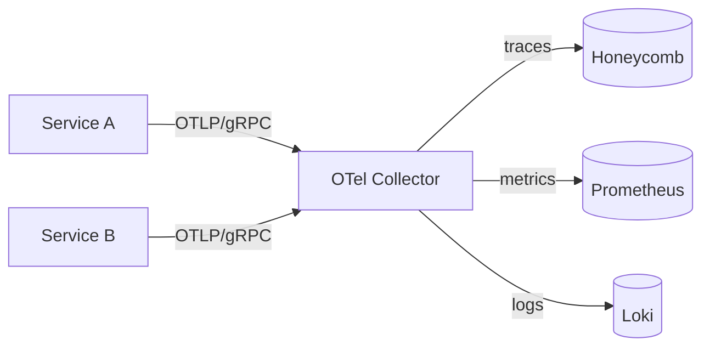

<!-- markdownlint-disable-file MD025 MD041 -->

# RFC 0003: Standardize on OpenTelemetry for traces, metrics, and logs

**Status:** Accepted
**Author:** Donald Gifford
**Date:** 2026-05-17

<!--toc:start-->
- [Summary](#summary)
- [Problem Statement](#problem-statement)
- [Proposed Solution](#proposed-solution)
- [Design](#design)
  - [Collector deployment](#collector-deployment)
  - [Instrumentation conventions](#instrumentation-conventions)
  - [Example: Go service](#example-go-service)
- [Alternatives Considered](#alternatives-considered)
- [Implementation Phases](#implementation-phases)
  - [Phase 1: Collector + Go SDK baseline](#phase-1-collector--go-sdk-baseline)
  - [Phase 2: JVM + Node fan-out](#phase-2-jvm--node-fan-out)
  - [Phase 3: Decommission](#phase-3-decommission)
- [Risks and Mitigations](#risks-and-mitigations)
- [Success Criteria](#success-criteria)
- [References](#references)
<!--toc:end-->

## Summary

Adopt **OpenTelemetry (OTel)** as the single instrumentation API across all services for traces, metrics, and logs. Export to a vendor-neutral collector that fans out to Honeycomb (traces), Prometheus (metrics), and Loki (logs). Retire StatsD, the in-house tracer, and ad-hoc Logstash shippers.

## Problem Statement

Today, observability is fragmented:

- **Traces:** in-house tracer in 6 services; Jaeger client in 4; nothing in 6.
- **Metrics:** StatsD (legacy), Prometheus scrape (newer), and a Datadog agent on the analytics fleet.
- **Logs:** stdout + Loki for some, stdout + Datadog for others, a Filebeat tail for the JVM monolith.

Result: stitching a request across services requires three tools and a working knowledge of three correlation-id schemes. When `order-svc` SLO burns, the on-call drills through Jaeger → Datadog dashboards → grep Loki → cross-reference Kibana. Average MTTR from page to root-cause is **23 minutes**; the bulk of that is context-switching, not analysis.

## Proposed Solution

OpenTelemetry as a single, vendor-neutral instrumentation API:



- Auto-instrumentation where it exists (JVM, Node, Python).
- Manual spans on the request handler + downstream call boundaries.
- W3C `traceparent` propagated across all internal HTTP and Kafka boundaries.

## Design

### Collector deployment

One OTel Collector per Kubernetes node, daemonset. Services target `$(NODE_IP):4317` (OTLP/gRPC). The collector handles batching, head sampling (5% of OK traffic, 100% of errors), and routing.

### Instrumentation conventions

- **Service identity:** `service.name`, `service.version`, `deployment.environment` set from env vars at startup.
- **Request span name:** `<HTTP_METHOD> <ROUTE_TEMPLATE>` (e.g. `GET /orders/{id}`).
- **Error semantics:** `Span.SetStatus(codes.Error, "...")` only for true failures; 4xx-class responses are *not* span errors.

### Example: Go service

```go
import (
    "go.opentelemetry.io/otel"
    "go.opentelemetry.io/otel/attribute"
)

func handleGetOrder(w http.ResponseWriter, r *http.Request) {
    ctx, span := otel.Tracer("order-svc").Start(r.Context(), "GET /orders/{id}")
    defer span.End()

    id := chi.URLParam(r, "id")
    span.SetAttributes(attribute.String("order.id", id))

    order, err := loadOrder(ctx, id)
    if err != nil {
        span.RecordError(err)
        span.SetStatus(codes.Error, "load failed")
        http.Error(w, "lookup failed", http.StatusInternalServerError)
        return
    }
    json.NewEncoder(w).Encode(order)
}
```

> [!TIP]
> Pin the OTel SDK version per language in a shared `otel-baseline` dependency. Drift in `go.opentelemetry.io/otel` versions across services is the single biggest cause of "spans don't link" outages we've seen on early adopters.

## Alternatives Considered

- **Stay on Jaeger client + StatsD + ad-hoc logging.** Cheapest in the short term; locks us out of vendor-neutral exports and means new services keep inventing their own shipping.
- **Adopt Datadog APM end-to-end.** Single-vendor convenience but high cost at our trace volume; couples us to one observability vendor permanently.
- **Custom OTLP shim.** Considered briefly — gives us nothing the official collector doesn't already do.

## Implementation Phases

### Phase 1: Collector + Go SDK baseline

- Stand up the per-node collector daemonset in staging and production.
- Roll out OTel SDK to the three Go services that bisect the order-processing critical path.
- Validate traces land in Honeycomb with correct parent-child links across HTTP boundaries.

### Phase 2: JVM + Node fan-out

- Instrument the 5 JVM services using the OTel Java agent.
- Instrument the 3 Node services using `@opentelemetry/auto-instrumentations-node`.
- Migrate StatsD callers in those services to OTel metrics.

### Phase 3: Decommission

- Remove the in-house tracer code from the 6 services that still embed it.
- Decommission the Datadog APM contract once analytics fleet is on OTel + Prometheus.

## Risks and Mitigations

| Risk | Impact | Likelihood | Mitigation |
|------|--------|------------|------------|
| Collector becomes a bottleneck | High | Medium | Daemonset (per-node fan-in) + autoscaled gateway tier |
| SDK version drift across services | Medium | High | Shared `otel-baseline` dep + Renovate-pinned versions |
| Cardinality explosion in metrics | High | Medium | Aggregation rules in collector + cost dashboard per service |
| Auto-instrumentation noise | Low | High | Per-service allowlist for instrumented libraries |

## Success Criteria

- 100% of HTTP-facing services emit OTel traces with W3C `traceparent` propagation.
- MTTR from page to root-cause drops below 12 minutes (currently 23).
- Single dashboard answers "show me the slowest 1% of `POST /orders` in the last hour, with downstream timings".

## References

- [OpenTelemetry specification](https://opentelemetry.io/docs/specs/otel/)
- [W3C Trace Context](https://www.w3.org/TR/trace-context/)
- Related: [RFC-0001](./0001-adopt-postgresql-as-the-primary-application-data-store.md), [RFC-0007](./0007-move-ci-from-jenkins-to-github-actions.md)
