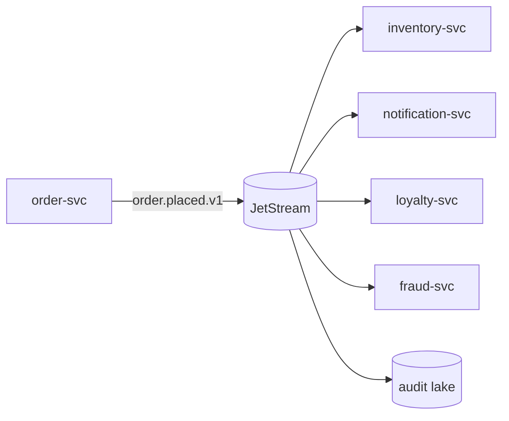

<!-- markdownlint-disable-file MD025 MD041 -->

# RFC 0006: Adopt an event-driven architecture using NATS JetStream

**Status:** Proposed
**Author:** Donald Gifford
**Date:** 2026-05-17

<!--toc:start-->
- [Summary](#summary)
- [Problem Statement](#problem-statement)
- [Proposed Solution](#proposed-solution)
- [Design](#design)
  - [Stream layout](#stream-layout)
  - [Event versioning](#event-versioning)
  - [Consumer ergonomics](#consumer-ergonomics)
  - [Observability](#observability)
- [Alternatives Considered](#alternatives-considered)
- [Implementation Phases](#implementation-phases)
  - [Phase 1: Cluster + outbox library (4 weeks)](#phase-1-cluster--outbox-library-4-weeks)
  - [Phase 2: First two domains (8 weeks)](#phase-2-first-two-domains-8-weeks)
  - [Phase 3: Webhook decom (8 weeks)](#phase-3-webhook-decom-8-weeks)
  - [Phase 4: Audit stream live (4 weeks)](#phase-4-audit-stream-live-4-weeks)
- [Risks and Mitigations](#risks-and-mitigations)
- [Success Criteria](#success-criteria)
- [References](#references)
<!--toc:end-->

## Summary

Adopt **NATS JetStream** as the event bus for cross-service workflows. Services publish domain events (`order.placed.v1`, `payment.captured.v1`, `inventory.reserved.v1`) to durable streams; downstream services consume via pull subscriptions with explicit ack. Replaces the current mix of webhook callbacks and synchronous gRPC fan-out for use cases that don't need request-response semantics.

## Problem Statement

Today, cross-service coordination is synchronous and brittle:

- `order-svc` synchronously calls `inventory-svc`, `notification-svc`, `loyalty-svc`, and `fraud-svc` on every placed order. Any downstream failure either blocks the order or requires custom retry plumbing in `order-svc`.
- The webhook fan-out for `payment.completed` (4 callers) has 6 different retry policies. Two of them silently drop on a 5xx.
- We have no replayable audit stream. When we need to reconstruct "what happened to order X", we read from 6 service logs and hope clocks aren't skewed.

## Proposed Solution



- **NATS JetStream** as the bus. Self-hosted on Kubernetes (3-node cluster, file-backed storage).
- **Outbox pattern** for publishing — events written to a Postgres `outbox` table in the same transaction as domain state, drained by a per-service relay process (per [RFC-0001](./0001-adopt-postgresql-as-the-primary-application-data-store.md)).
- **CloudEvents 1.0** envelope; payload is service-owned protobuf or JSON Schema.
- **Pull subscriptions** with explicit ack + per-consumer max-deliver = 5. After max, message lands in a dead-letter stream + pages on-call.

## Design

### Stream layout

| Stream | Retention | Replication | Subjects |
|--------|-----------|-------------|----------|
| `domain.orders` | 30 days | 3 | `orders.*` |
| `domain.payments` | 90 days (compliance) | 3 | `payments.*` |
| `domain.inventory` | 14 days | 3 | `inventory.*` |
| `dlq.all` | 90 days | 3 | `dlq.>` |

### Event versioning

Events are versioned in the subject (`order.placed.v1`). Producers may emit new versions; consumers explicitly opt in. v1 is supported for at least 12 months after v2 ships.

### Consumer ergonomics

Each consumer is a durable pull subscription with:

```go
sub, _ := js.PullSubscribe(
    "orders.placed.v1",
    "inventory-svc",
    nats.AckExplicit(),
    nats.MaxDeliver(5),
    nats.AckWait(30*time.Second),
)
```

### Observability

- Each event carries a `traceparent` per the OTel convention (see [RFC-0003](./0003-standardize-on-opentelemetry-for-traces-metrics-and-logs.md)).
- Consumer lag is exported as a Prometheus gauge per `{stream, consumer}` pair.
- The relay process emits `outbox.lag.seconds` so we can SLO the publish path independently of consumer health.

## Alternatives Considered

- **Apache Kafka.** Higher operational floor, more mature ecosystem, but our throughput numbers (~50k events/sec peak) don't justify the cluster cost or operational complexity for the scale we're at.
- **AWS SNS + SQS fan-out.** Managed and cheap. Loses ordering guarantees per partition and adds vendor coupling at a moment when we're also evaluating GCP egress.
- **Redis Streams.** Operationally familiar. Durability story is weaker than JetStream's file-backed log.
- **Stay synchronous + retry plumbing.** Current pain.

## Implementation Phases

### Phase 1: Cluster + outbox library (4 weeks)

- Stand up 3-node JetStream cluster in staging and production.
- Build the per-service outbox library (Go + Java) — single dependency, opinionated retry policy.

### Phase 2: First two domains (8 weeks)

- `order-svc` publishes `order.placed.v1`, `order.cancelled.v1`.
- `inventory-svc` and `notification-svc` migrate from the synchronous call to JetStream consumers.

### Phase 3: Webhook decom (8 weeks)

- Migrate `payment.completed` fan-out from custom webhook callbacks to JetStream.
- Retire the in-house webhook delivery service.

### Phase 4: Audit stream live (4 weeks)

- All `domain.*` streams replicated to the audit lake; on-call playbook updated to use the audit stream as the source of truth for cross-service forensics.

## Risks and Mitigations

| Risk | Impact | Likelihood | Mitigation |
|------|--------|------------|------------|
| Operational maturity gap (no JetStream experience in-house) | High | High | Pre-production runbook + chaos drills; SRE on-call rotation training |
| Outbox relay lag during DB hot windows | High | Medium | SLO + alerts on `outbox.lag.seconds`; per-domain relay isolation |
| Event-versioning drift | Medium | High | Mandatory `v<N>` subject naming + 12-month deprecation policy |
| At-least-once → consumer idempotency burden | Medium | High | Idempotency-key conventions documented + linter rule for handlers |

## Success Criteria

- 4 production domains fully migrated to JetStream within 6 months of acceptance.
- Cross-service forensics queries (e.g. "show me the full event timeline for order X") answerable from the audit stream alone, no log-grepping.
- Synchronous fan-out from `order-svc` reduced to zero.

## References

- [NATS JetStream documentation](https://docs.nats.io/nats-concepts/jetstream)
- [CloudEvents 1.0 spec](https://github.com/cloudevents/spec)
- [Outbox pattern](https://microservices.io/patterns/data/transactional-outbox.html)
- Related: [RFC-0001](./0001-adopt-postgresql-as-the-primary-application-data-store.md), [RFC-0003](./0003-standardize-on-opentelemetry-for-traces-metrics-and-logs.md)
